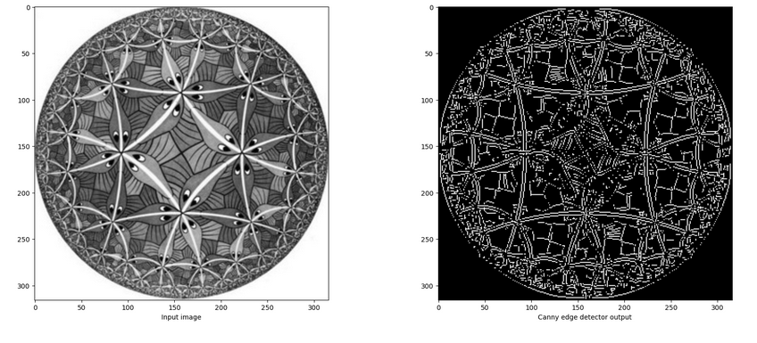

# 🖼️ Computer Vision Techniques: Image Filtering, Edge Detection & Object Identification  

## 📌 Overview  
This project explores fundamental techniques in **Computer Vision**, focusing on:  
✅ **Image Filtering** (1D & 2D filters)  
✅ **Edge Detection** (Sobel, Laplacian, Canny)  
✅ **Object Identification** (Color Histograms, Image Retrieval)  
✅ **Performance Evaluation**  

Each section includes **theory**, **code implementation**, and **visual results**, demonstrating practical applications of these methods.  

## 📚 Techniques Covered  
### 1️⃣ Image Filtering  
- Applying **1D and 2D filters** (Gaussian, Mean, Laplacian)  
- Smoothing & noise reduction  

### 2️⃣ Edge Detection  
- **Sobel operator** to compute gradient magnitudes  
- **Discrete Laplacian** for second-order derivatives  
- **Canny Edge Detector** for optimal edge detection  

### 3️⃣ Object Identification  
- **3D Joint Color Histograms** for feature extraction  
- **Histogram Metrics** (Intersection, Bhattacharyya, Chi-Square)  
- **Image Retrieval** using similarity measures  

### 4️⃣ Performance Evaluation (Bonus)  
- Evaluating accuracy of object identification  
- Comparing retrieval techniques  

## 🔍 Example Results  
📷 **Edge Detection Example**  
  

📷 **Object Retrieval Example**  
  
